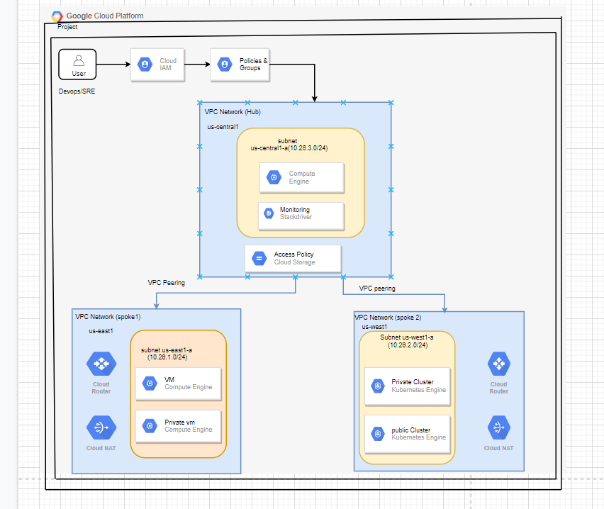

# GCP Landing Zone - IaC Pipelines With Terraform And CI/CD with Cloud Build

## 1.0 Introduction

- This Document shows how to deploy IaaS Cloud Landing Zone Using IaC & CI/CD. Landing Zone is defined as, ‘A configured environment with a standard set of secured cloud infrastructure, logging configured, policies, best practices, guidelines, vNets Peered and centrally managed services.’. This helps customers to quickly set up a secure, multi-account Cloud environment based on industry best practices.

## 2.0 Setup

- In order to complete this, you'll need to install the following tools

- Terraform : This uses terraform to deploy resources

- Git: Used to clone the code and trigger the new deployments

- GCP: You need a GCP account with billing enabled

## 3.0 Components

- Creating Resource hierarchy with projects/folders/Structure

- VPC with relevant firewall rules - 3 (1hub and 2 spoke)

- Subnets - 3 for each network

- vpc peering 1- Hub to spoke1 

- vpc peering 2- Hub to spoke2

- cloud nat gateways - 2

- cloud routers - 2

- cloud IAM required roles

- setup monitoring using stackdriver

- compute instances in HUB & spoke1 vpc

- GKE cluster in spoke2 vpc

## 4.0 PROBLEM STATEMENT

- Build a landing zone in gcp to host customers business workloads. Landing Zone is a Mix of Networking and environment construct. When a Landing zone is setup it involves series of steps involved, these are common and repeatable for any given customer with minor changes to the environment. When done manually these are time consuming and error prone.

- With Automation these can be repeatable and shippable. It helps to achieve faster to market and faster release management

## 5.0 SOLUTION

- The Google cloud will deliver managed infrastructure and services automatically where it creates a network topology for a Particular Region with Hub Spoke Setup, vNets Peered, Logging configured, Policy Applied.

- The Environment setup should be completely automated with IaC. It will reduce the manual error and faster delivery and Onboarding.

- Create Intelligent landing zone with CI/CD tools for continuous integration, continuous delivery, and continuous optimization.

## 6.0 Workflow Architecture using VPC Network Peering

- The following diagram shows a hub-and-spoke network using VPC Network Peering, which enables secure communication between resources in separate VPC networks over Google's internal network using private IP addresses, without the inter-VPC network traffic traversing the public internet.

## 6.1 Objectives

Provision the following resources in Google Cloud by using a Google-provided Terraform template:

•	Three VPC networks, one designated as the hub and the other two as spokes.

•	A subnet in each of the VPC networks in a region (us-central1) that you specify.

•	VPC Network Peering configurations between each spoke VPC network and the hub VPC network.

•	A set of firewall rules for each VPC network.

•	A Cloud NAT gateway for each spoke VPC network.

•	A test Compute Engine instance in the spoke-1 VPC network.

-  I'm using Terraform setup a remote backend to manage state. I’ve setup a backend.tf file for the connection and declaration of GCS for the Terraform state files.

•	A test Google Kubernetes Engine (GKE) cluster with a single node pool in the spoke-2 VPC network.

- Monitoring for CPU usage and GKE Node CPU Utilization

1. Creates Alert Policies for CPU utilization

 2. Creates Alert Policies for Gke node cpu utilization

 3. Sends Notification to Notification channel when it reaches to threshold value.

•	To allow a path between spokes and on-premises, custom routes exchange is configured between the hub and each spoke.

## 6.2 Fundamentals of Cloud Landing Zone:

	
•	In the architecture, the resources that need network-level isolation use separate spoke VPC networks. For example, the architecture shows a Compute Engine VM in the spoke-1 VPC network. The spoke-2 VPC network has a Compute Engine VM and a Google Kubernetes Engine (GKE) cluster.

•	Each spoke VPC network in this architecture has a peering relationship with a central hub VPC network.

•	Each spoke VPC network has a Cloud NAT gateway for outbound communication with the internet.

•	The peering connections between the spoke VPC networks and the hub VPC network don't allow transitive traffic; that is, inter-spoke communication through the hub is not possible. 

•	Resources such as GKE private nodes and Cloud GCE instances that have private IP addresses require a proxy for access from outside their VPC network.

•	Peering is a non-transitive relationship, meaning each network you want to connect must be directly linked. Sending network traffic through a middle device, usually a router, lets you set rules for where traffic goes and access permissions.

## 6.3 Get the required permissions:

To create and manage resources by using the provided Terraform templates, the Google account or service account needs the following Identity and Access Management (IAM) roles:

Project level Access	                         IAM Roles

Compute Admin                                   roles/compute.admin

Kubernetes Engine Admin                         roles/container.admin

Service Account Admin	                        roles/iam.serviceAccountAdmin

Project IAM Admin	                            roles/resourcemanager.

projectIamAdmin                                 roles/serviceusage.

serviceUsageAdmin                               roles/resourcemanager.

Service Usage Admin	                            roles/serviceusage.

serviceUsageAdmin                               roles/resourcemanager.
Project Creator                                  projectCreator

## 7.0 Cloud Build and Terraform

-  Cloud Build comes with full CI/CD capability with which we can automate Terraform.

##  7.1 Terraform State

- A Terraform state is an object that keeps track of the managed infrastructure and configuration. It can be both local and remote.we want to put the Terraform state on a GCP storage bucket, we first need to create that bucket with Terraform and then migrate the state.

## 8.0 Implementation

## Fig: IAC pipeline with cloud build

- Let us have a look at the following directory structure

The entire IAC code of the Landind zone is located in the iac folder in the directory structure
 you can refer the below link for the iac code

 https://github.dxc.com/google-cloud-delivery/Landing_zone/tree/develop

 # 9.0 Deploy the GCP resourcec using Terraform

 - Clone the following repository containing the sample code, then switch to the terraform directory

 $ git clone https://github.dxc.com/google-cloud-delivery/Landing_zone/tree/develop

 $cd Landing_zone/asset/gcp_landingzone/src/iac

 - Next, copy the terraform.tfvars and replace the value of the project variables.

 # 9.1 Cloud Build triggers

 - A Cloud Build trigger automatically starts a build whenever you make any changes to your source code. You can configure the trigger to build your code on any changes to the source repository or only changes that match certain criteria.

 - They get triggered upon creation/pushing or merging a pull request into master. 

## Steps:

- Connecting to your source repositories i.e GitHub
-  Creating a build trigger

 - Change the Cloud Build configuration file (yaml or json): Use a build config file for your configuration. 
 

 
 - you can refer the below link for the configuration .yaml files.

 - https://github.dxc.com/google-cloud-delivery/Landing_zone/blob/develop/cloudbuild.yaml

 - Change the directoray path in the yaml file

 - Testing a build trigger.
