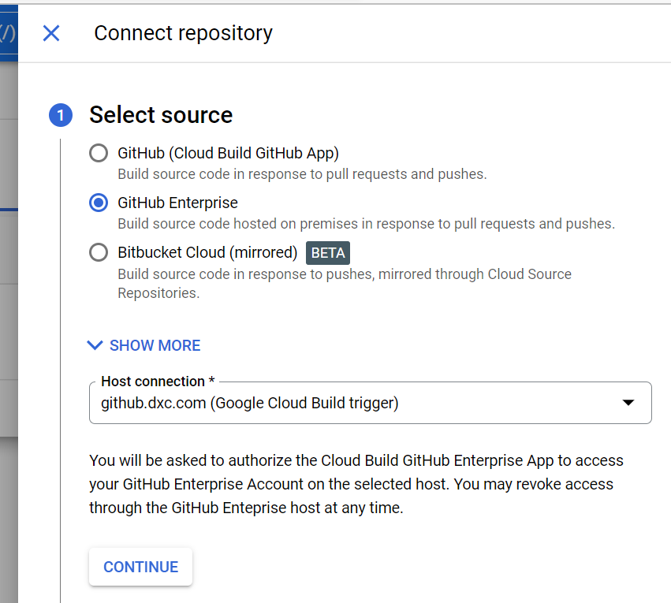
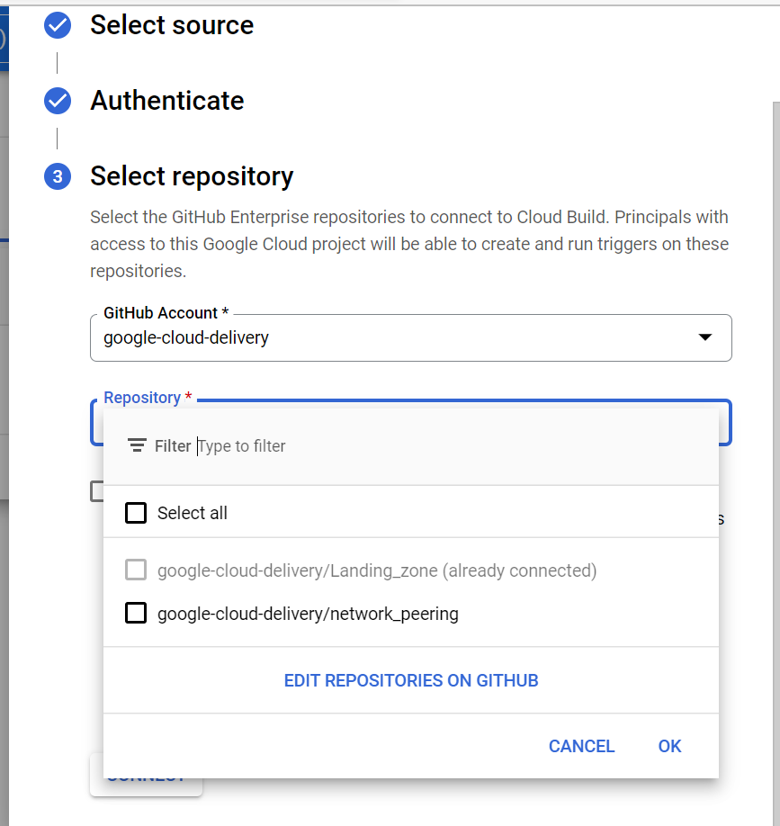
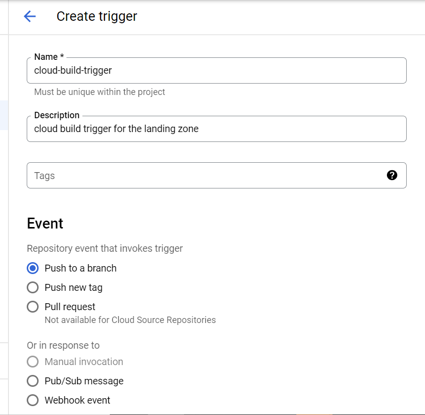
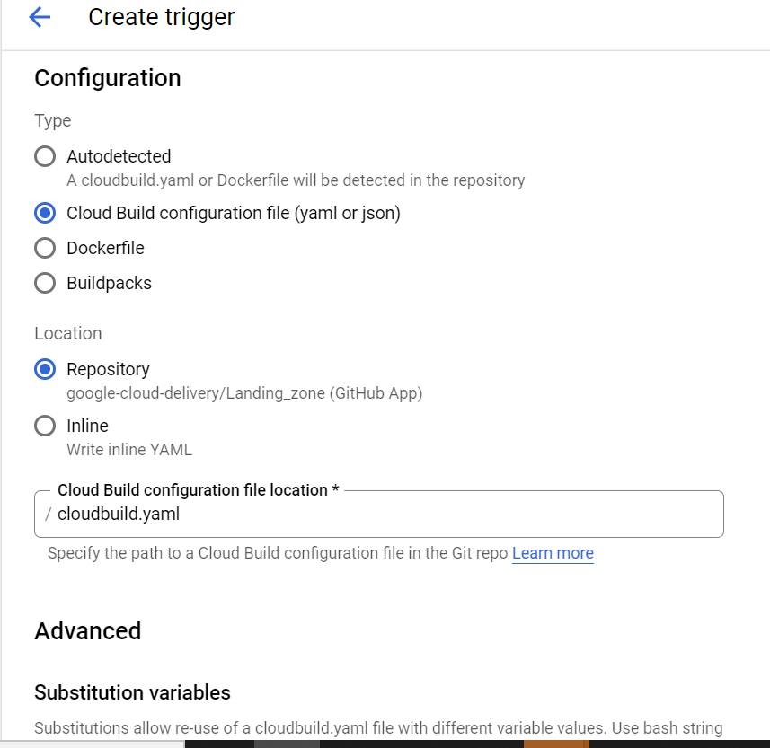
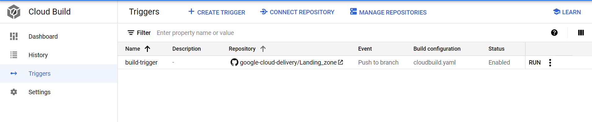

# Creating and managing build triggers

- A Cloud Build trigger automatically starts a build whenever you make any changes to your source code. You can configure the trigger to build your code on any changes to the source repository or only changes that match certain criteria.

- This  explains how to connect to source repositories such as GitHub and Bitbucket, and create build triggers to build the code in the repositories.

# Before you begin

- Enable the Cloud Build API.

- You need to have the Cloud Build Editor (roles/cloudbuild.builds.editor) role in your project to create triggers.

- You need source code in Cloud Source Repositories, GitHub.

- You need either a Dockerfile or a Cloud Build config file (YAMl file).

# Connecting to source repositories

- You must first connect Cloud Build to your source repository before building the code in that repository

- If you are connecting an external repository, such as one hosted on GitHub or Bitbucket, you will need admin-level permissions on the repository to initially connect  your  repository to Cloud Build. Admin permissions are not required to create triggers in a repository that is already connected to Cloud Build.

# Complete the following steps to connect to GitHub :

- Open the Triggers page in the Google Cloud Console.

- Select your project and click Open.

- Click Connect Repository.

- Select the repository where you've stored your source code.

- If you select GitHub as your source repository, Cloud Build mirrors your repository in Cloud Source Repositories and uses the mirrored repository for all its operations.

- Click Continue.

- Authenticate to your source repository with your username and password.

- From the list of available repositories, select the desired repository, then click Connect.

- For external repositories, such as GitHub and Bitbucket, you must have owner-level permissions for the Cloud project with which you're working.

- Click Create a trigger to continue creating a build trigger to automate builds for the source code in the repository, or click Done.

# Creating a build trigger

Enter the following trigger settings:

- Name: Enter a name for your trigger.

- Description (optional): Enter a description for your trigger.

- Event: Select the repository event to invoke your trigger.

- Push to a branch: Set your trigger to start a build on commits to a particular branch.

- Pull request (Cloud Source Repositories not supported): Set your trigger to start a build on commits to a pull request. This feature is only available if you create a GitHub trigger. To learn how to create a GitHub App trigger, see Creating GitHub triggers.

- Repository: From the list of available repositories, select the desired repository. To connect a new repository, see Connecting to source repositories.
When your build executes, the contents of your repository will be copied to /workspace, the default working directory used by Cloud Build. Learn more about working directories on the Build configuration overview page.

- Branch or Tag: Specify a regular expression with the branch or tag value to match. Forward slashes (/) cannot be used in tags. For more information on acceptable regular expression syntax, see RE2 syntax.

- Type: Select the type of configuration to use for your build.

# Cloud Build configuration file (yaml or json): Use a build config file for your configuration.

- Dockerfile: Use a Dockerfile for your configuration.

- Buildpacks: Use buildpacks for your configuration.

- Location: Specify the location for your configuration.

# Testing a build trigger

To manually test a build trigger:

Open the Triggers page in the Google Cloud Console.

Open the triggers page

Locate your trigger in the list and then click Run trigger.

