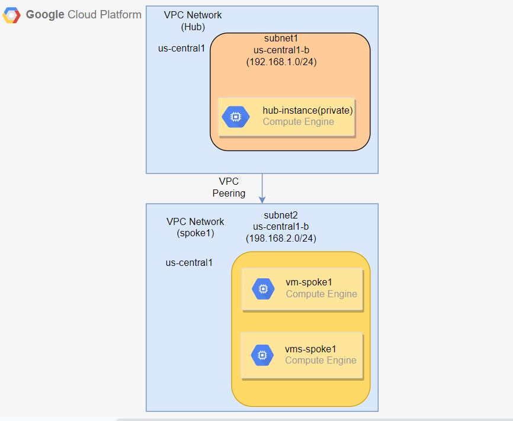

# Compute Enginee
   In this Module I am creating one private and two public compute enginee in different subnetworks.
   All compute enginee will be created in same zone. These compute enginee are attached with network interface. 

# Need VPC Module 
For Creation of virtual machines we need VPC for creating it into specific networks , & for that we are using vpc module output file as a input for our compute enginee module. By the use of this vpc module , virtual machines will be created as per the hub & spoke model requiremnet. while creation of vm we are using small script which will install apache2 server , this script is for testing purpose.

# private and public vm
 In this compute module we are creating three virtual machines one private and two public in spoke1 and hub respectively.The values for regions are coming out of variables.tf files defined within each sub-module folder. By the use of cloud nat we can access our private vm in secure manner.

# The following diagram shows the architecture of vm deployment. It consists of two public vm , one private vm in different subnetworks.

# IAM Roles 

Identity and Access Management (IAM) provides predefined roles that give fine-grained access to specific Google Cloud resources and help prevent unwanted access to other resources.

We can  create custom IAM roles. Custom roles  provide granular access according to a user-specified list of permissions.

Custom roles are similar to predefined roles, but they are created and managed by users directly. We can create custom roles at the organization or a project level, by selecting the list of permissions it should have.

Custom roles cannot be created at a Folder level (only Organization or project level).

# List of roles we are using are listed below

1. Compute Admin :-

   Full control of all Compute Engine resources.
   If the user will be managing virtual machine instances that are configured to run as a service account.

2. Kubernetes Engine Admin :-
   
   Provides access to full management of clusters and their Kubernetes API objects.
   

3. ServiceAccount Admin :-

   Includes permissions to list service accounts and get details about a service account. Also includes permissions to create, update, and delete service accounts, and to view or change the IAM policy on a service account.

4. Project IAM Admin :-

   Provides permissions to administer IAM policies on projects

5. Service Usage Admin :-

    Ability to enable, disable, and inspect service states, inspect operations, and consume quota and billing for a consumer project.

6. Project Creator :-

    Provides access to create new projects. Once a user creates a project, they're automatically granted the owner role for that project. 
