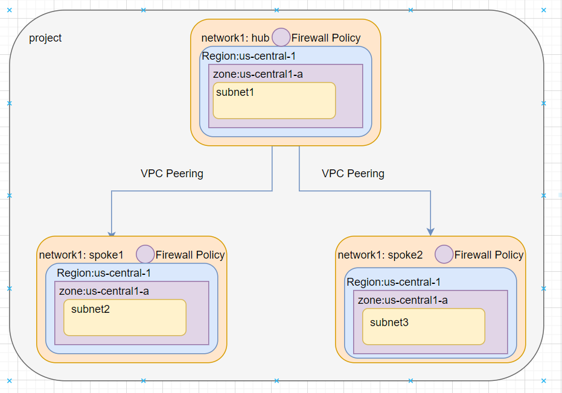
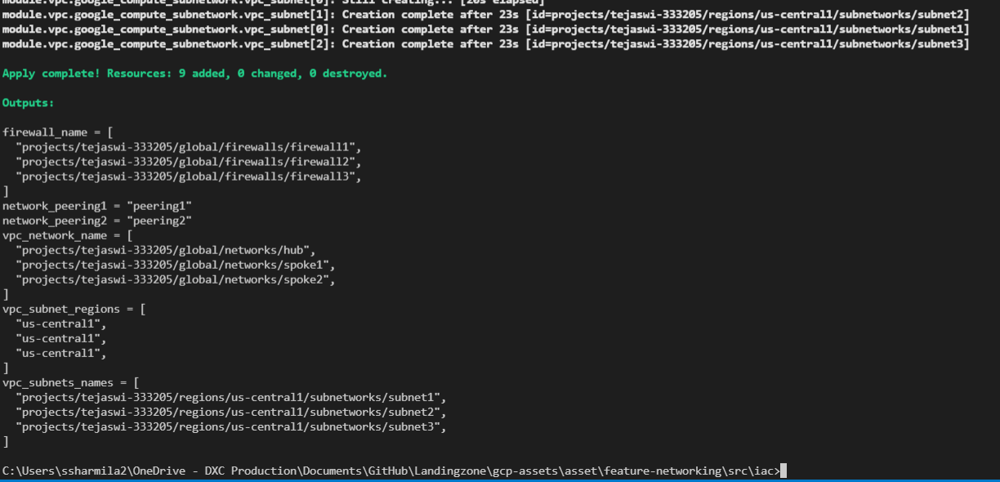

## Deploy a hub-and-spoke network using VPC Network Peering:

- This Architectutr shows how to set up a hub-and-spoke network in Google Cloud using the network peering capability of Virtual Private Cloud (VPC). VPC Network Peering enables you to connect VPC networks so that workloads in different VPC networks can communicate internally. Traffic stays within Google's network and doesn't go through the public internet.

- The following diagram shows the architecture that you deploy. It consists of two spoke VPC networks, each peered with a central hub VPC network.

# Architecture Objectives:

Provision the following resources in Google Cloud by using a Google-provided Terraform template:

•	Three VPC networks, one designated as the hub and the other two as spokes.

•	A subnet in each of the VPC networks in a region (us-central1) that you specify.

•	VPC Network Peering configurations between each spoke VPC network and the hub VPC network.

•	A set of firewall rules for each VPC network.

# Fundamentals of Cloud Landing Zone:
	
•	In the architecture, the resources that need network-level isolation use separate spoke VPC networks. For example, the architecture shows a Compute Engine VM in the spoke-1 VPC network. The spoke-2 VPC network has a Compute Engine VM and a Google Kubernetes Engine (GKE) cluster.

•	Each spoke VPC network in this architecture has a peering relationship with a central hub VPC network.

•	Each spoke VPC network has a Cloud NAT gateway for outbound communication with the internet.

•	The peering connections between the spoke VPC networks and the hub VPC network don't allow transitive traffic; that is, inter-spoke communication through the hub is not possible. 

•	Peering is a non-transitive relationship, meaning each network you want to connect must be directly linked. Sending network traffic through a middle device, usually a router, lets you set rules for where traffic goes and access permissions.

Result:

- This module creates hub and spoke network with subnets and firewall rules and those networks are connected using vpc peering

