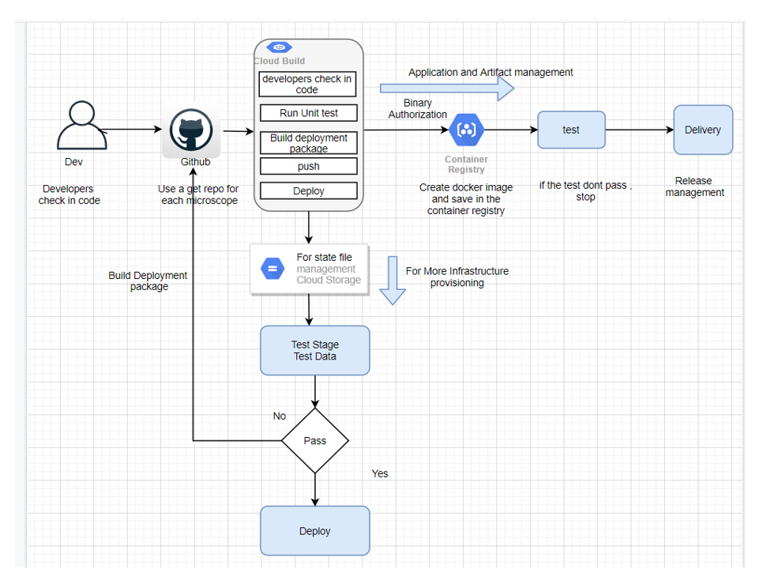
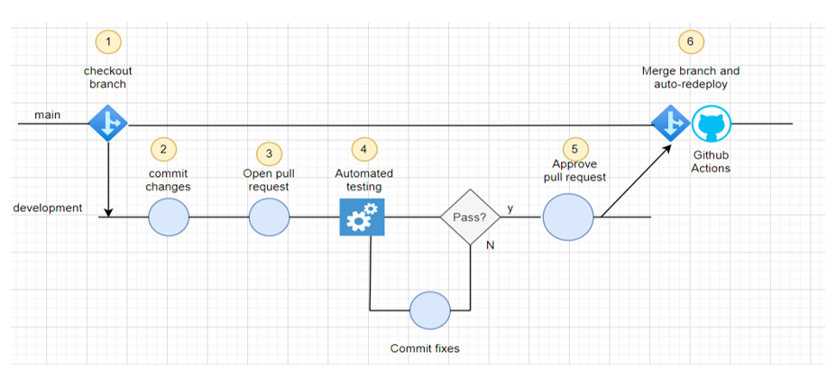

## CI/CD Workflow:
	For the purposes of illustrating this workflow, we will assume the following:

•	The code lives in version control.

•	We are using a git flow development model.

Here are the steps:
1.	Clone a copy of the source code and create a new branch
2.	Run the code
3.	Make code changes
4.	Submit changes for review
5.	Run automated tests
6.	Merge and release
7.	Deploy

## What is CI/CD?
CI/CD is an abbreviation for Continuous Integration/Continuous Deployment (or Continuous Delivery). Much ink has been spilled defining the scope of each of these terms. We will prioritize basic concepts over comprehensive coverage, and show how we can apply those basics to our simple pipeline.

Continuous Integration (CI): refers to using automation to frequently build, test, and merge code changes to a branch in a shared repository. The basic motivation behind CI is pursuing faster developer iteration and deployment of changes compared to a process with larger, infrequent integration events where many changes, often from multiple developers, are de-conflicted and tested at the same time.

Continuous Deployment (CD): refers to using automation to frequently redeploy a software project. The basic motivation behind CD is freeing operations teams from executing time-consuming and error-prone manual deployment processes while getting changes out to users quickly. For our batch processing pipeline, deployment simply means re-running the pipeline to update the database when changes are pushed to main. This ensures the database always reflects the output of the latest pipeline version pushed to main.

CI/CD can be easier to explain with concrete examples. Let’s see how we can use GitHub Actions to incorporate CI/CD into our simple pipeline.

## GitHub Flow Considerations:

1.	Any code in the main branch should be deployable.
2.	Create new descriptively named branches off the main branch for new work, such as feature.
3.	Commit new work to your local branches and regularly push work to the remote.
4.	To request feedback or help, or when you think your work is ready to merge into the main branch, open a pull request.
5.	After your work or feature has been reviewed and approved, it can be merged into the main branch.
6.	Once your work has been merged into the main branch, it should be deployed immediately.

## Push your Code to GitHub Repository using Command Line

To initialize empty local git repository, type the below command.

--git init

You can either add individual files or directories or add all unstaged files using below command.

git add .

For adding individual file, type the file name in place of the dot.

git add README.md

To see the branches in your repository, use the below command.

git branch

 You can create a new branch using the command.

git checkout -b <branch-name>

Alternatively, you can use two commands to create a branch and then checkout so that you can start working on it.

git branch <branch-name> 
git checkout <branch-name>

You can either add individual files or directories or add all unstaged files using below command.

git add .

Now we need to commit our code changes made to the files to a local repository. Each commit will have an unique ID for the reference. It is important to add a commit message as well, that will tell us what changes we have made.

git commit -m "first commit"

Finally we push our code to the GitHub and also mention the branch.

git push -u origin main